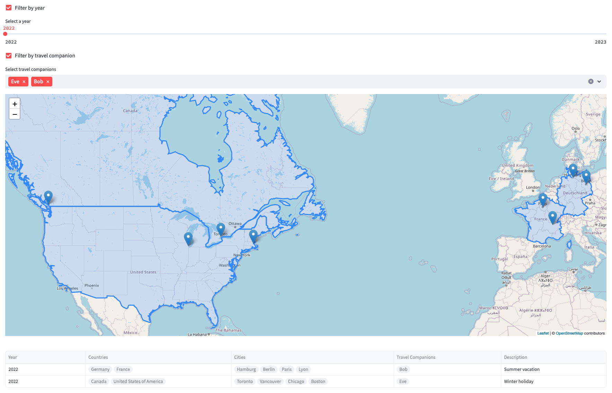

# Trips Map

A tool to visualize your trips

# Prerequisites

- [uv](https://docs.astral.sh/uv/)
- Python (see [`pyproject.toml`](pyproject.toml) for supported versions)

## Installation

1. Clone this repo
2. `uv sync`

## Running the app

`uv run streamlit run main.py`

## Trips file format

See explanation [here](trips_file_format.md).

## Contributing

Contributions are welcome! Please feel free to submit pull requests or open issues to suggest improvements or add new features.

## License

See [here](LICENSE).
